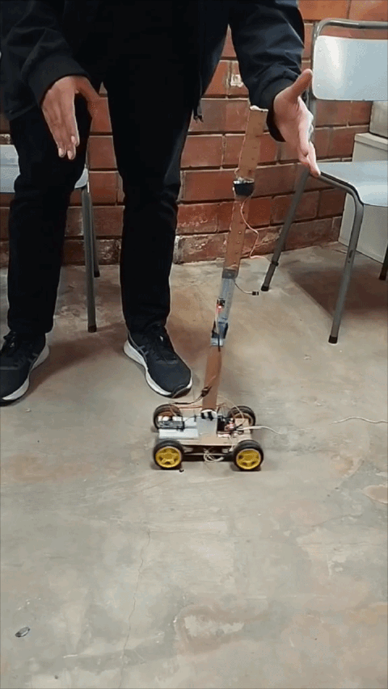

# Inverted Pendulum on a Cart — Embedded Control System

> A full-stack mechatronics project: mechanical design, mathematical modeling, and real-time PID control on an ESP32 — balancing an inverted pendulum through cart motion.

  

---

## Overview

This project implements a **real-time control system** for an **Inverted Pendulum on a Cart** — a classic benchmark in control theory. The goal is to:

1. **Model the Dynamics** using Lagrangian mechanics to understand the non-linear relationship between wheel torque and pendulum angle.
2. **Stabilize** the pendulum at the unstable upright equilibrium point by applying precise horizontal acceleration via a 4WD DC motor chassis.

The system was developed from the ground up: mechanical structure (SolidWorks), mathematical derivation (Lagrangian), and embedded firmware (ESP32 + C++).

---

## Control Strategy

### Modeling
The system dynamics were derived using **Lagrangian Mechanics** ($L = T - V$). The state vector is defined as $X = [x, \dot{x}, \theta, \dot{\theta}]^T$, representing cart position, cart velocity, pendulum angle, and angular velocity. 

### Stabilization
The controller is designed around the **linearized model** at the upright position ($\theta = 0$). 
* **PID Control:** A high-frequency control loop runs on the ESP32, processing IMU (MPU6050) feedback to calculate the required motor PWM for the 4WD system.
* **Mass Tuning:** To increase system inertia and lower the center of mass for better stability, the pendulum mass was modified by mounting two **MG995 servos** as dead weights in the middle of the rod.

---

## 📐 System Architecture

┌────────────────┐      PWM / Direction      ┌────────────────┐
│     ESP32      │ ────────────────────────> │  L298N Driver  │
│  (PID Control) │                           │ (Motor Control)│
└───────┬────────┘                           └───────┬────────┘
        │                                            │
        │           ┌────────────────┐               │ Drive
    Feedback        │  MPU6050 IMU   │               │ Signal
   (Angle/Acc)      │ (On Pendulum)  │               │
        │           └───────┬────────┘               ▼
        │                   │                ┌────────────────┐
        └───────────────────┴─────────────── │ 4WD DC Chassis │
                                             │ (Yellow Motors)│
                                             └────────────────┘
                                             
---

## 📊 System Parameters

| Parameter | Value |
| :--- | :--- |
| **Total Cart Mass (M)** | ~0.5 kg |
| **Pendulum Mass (m)** | ~150g (Modified with 2x MG995 Servos) |
| **Pendulum Length (L)** | 0.65 m |
| **MCU** | ESP32 (Dual-Core) |
| **Actuators** | 4x Geared Yellow DC Motors |
| **Sensor** | MPU6050 (Accelerometer/Gyroscope) |

---

## 🛠 Software Stack

| Layer | Tool / Framework |
|---|---|
| Mechanical CAD | SolidWorks |
| Mathematical Modeling | Lagrangian Mechanics |
| Embedded Firmware | Arduino / C++ (ESP32) |
| Communication | Serial Monitor / Teleplot |

---

## 📂 Repository Structure
* **`/cad`**: SolidWorks assembly and part files for the 4WD chassis and pendulum holder.
* **`/code`**: ESP32 source code, PID implementation, and MPU6050 calibration logic.

---

## 🔧 Setup & Usage

1. **Hardware:**
   * Assemble the 4WD chassis using the provided SolidWorks designs.
   * Mount the MPU6050 IMU on the pendulum (adjust code if orientation changes).
   * Ensure the two MG995 servos are secured to the middle of the pendulum rod to achieve the specified inertia.
2. **Software:**
   * Open the `.ino` file in the `/code` folder.
   * Calibrate the IMU offsets for the gyro and accelerometer.
   * Upload the code to the ESP32 via Arduino IDE.

---

## 📝 Results

- Achieved stable upright balance using 4-wheel drive movement.
- Successfully accounted for the increased inertia provided by the additional servo weights.
- Handled real-world disturbances and recovery maneuvers.

---
*This project was completed for academic purposes focusing on Automation, Control Theory, and Robotics.*
